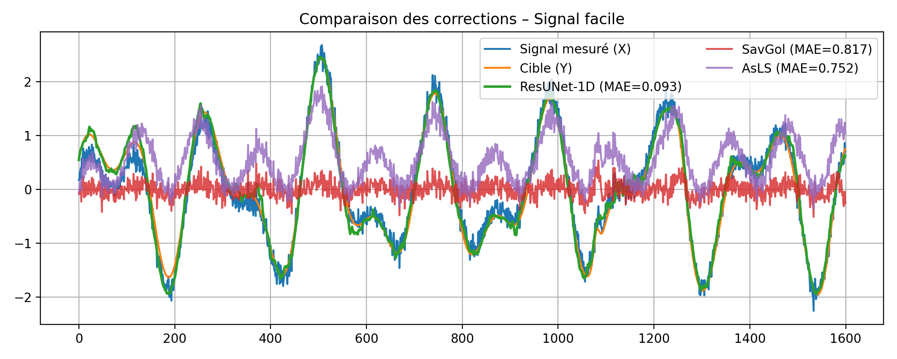
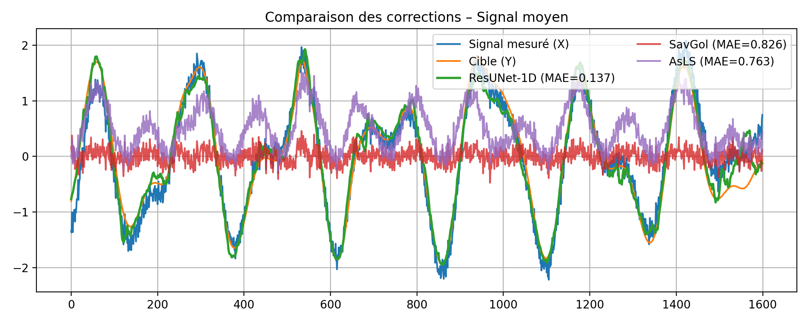
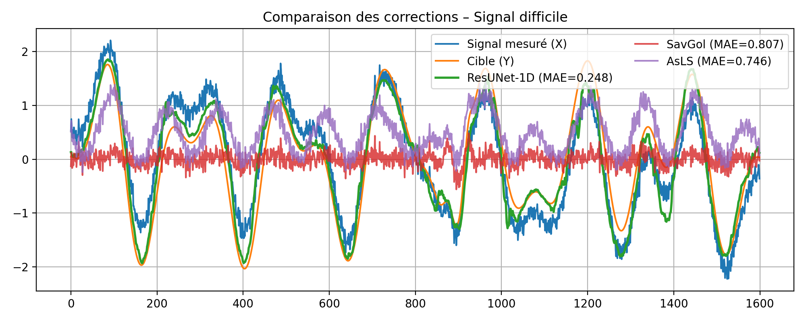

# Baseline Removal in Synthetic Signals Using ResUNet-1D

This project explores **automatic baseline correction** in 1D signals.
The goal is to train a **ResUNet-1D** model capable of removing complex nonlinear baselines from synthetic signals containing oscillatory dynamics and low-frequency drifts.

---

## Overview

Classical baseline estimation methods (e.g., **Savitzky–Golay**, **asymmetric least squares — AsLS**) assume simple and smooth trends (linear or polynomial).
However, in realistic vibration data, baselines can be nonlinear, time-dependent, and mixed with additive noise.

This project builds a **synthetic dataset** of signals of the form:

$s(t) = x(t) + b(t) + \varepsilon(t)$

where:

* $x(t)$ is the “true” oscillatory signal (sum of sinusoids + impulses),
* $b(t)$ is a slowly varying baseline (polynomial + low-frequency sine),
* $\varepsilon(t)$ is additive Gaussian noise.

The task is to **reconstruct $x(t)$** from the measured signal $s(t)$.

---

## Methodology

### 1. Synthetic Data Generation

* 2,000 signals of length 1,600 samples
* Baseline = polynomial (order 2–3) + low-frequency sine
* Gaussian noise $\mathcal{N}(0, \sigma^2)$
* Z-score normalization per sample

### 2. Evaluated Models

| Category  | Method           | Description                                  |
| --------- | ---------------- | -------------------------------------------- |
| Classical | Savitzky–Golay   | Local polynomial smoothing                   |
| Classical | AsLS (Whittaker) | Baseline via penalized least squares         |
| Learned   | **ResUNet-1D**   | 1D encoder-decoder with skip connections     |

### 3. Training Details

* Loss: Huber (Smooth L1)
* Optimizer: Adam (LR=1e-3, weight decay=1e-4)
* Scheduler: ReduceLROnPlateau
* Early stopping: patience 7
* Framework: PyTorch
* Epochs: up to 50 (best model saved automatically)

---

## Results

| Method                  | RMSE ↓            | MAE ↓             | r ↑       | ΔSNR (dB) ↑ |
| ----------------------- | ----------------- | ----------------- | --------- | ----------- |
| **ResUNet-1D**          | **0.196 ± 0.048** | **0.145 ± 0.035** | **0.980** | **+3.47**   |
| Savitzky–Golay (601, 2) | 0.248 ± 0.041     | 0.186 ± 0.029     | 0.969     | +1.21       |
| AsLS (λ=1e5, p=0.05)    | 0.823 ± 0.021     | 0.661 ± 0.017     | 0.802     | −7.41       |

The **ResUNet-1D** model generalizes far better than classical approaches, learning to remove complex nonlinear baselines and improving the signal-to-noise ratio by +3.5 dB on average.

---

## Qualitative Results

Below are representative examples comparing baseline removal methods:

| Easy Case                                     | Medium Case                                | Hard Case                                         |
| -------------------------------------------- | ----------------------------------------- | ------------------------------------------------ |
|  |  |  |

## Folder Structure
```bash
resunet-baseline-app/
│
├── app.py                         # Main Streamlit application
├── requirements.txt               # Python dependencies
├── README.md                      # Project documentation (with Streamlit link)
├── .gitignore                     # Ignore cache & env files
├── main                           # Main notebook
├── results/                       # Comparisons and metrics exports
